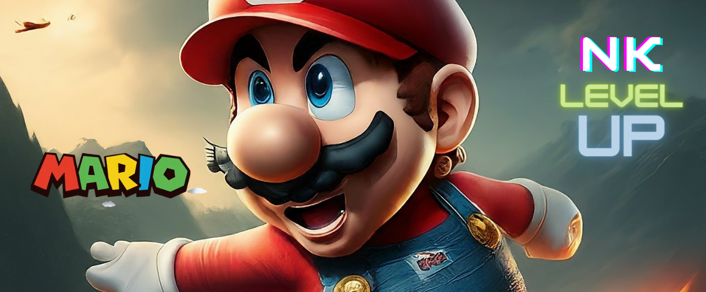

# Super Mario Adventure Game Dev.

Super Mario Adventure Game Dev. is a custom Mario game developed with HTML5, CSS, and JavaScript. Dive into a classic Mario platforming experience with modern enhancements and a built-in level editor.

## Anime Trailers
Anime Trailers in [Thai>>](https://www.youtube.com/watch?v=v5Vg3UghQ1Y) 
and in [English>>](https://www.youtube.com/watch?v=tMMke8QAcqA) 

To get started, clone this repository and set up your development environment.
- [Landing page:>>](https://github.com/worachat-dev/Super-Mario-Adventure-Landingpage-dev) 
- [Game dev.:>>](https://github.com/worachat-dev/Super-Mario-Adventure-Game-dev) 

## Table of Contents

- [Features](#features)
- [Getting Started](#getting-started)
- [Installation](#installation)
- [Usage](#usage)
- [Development](#development)
- [Contributing](#contributing)
- [Authors](#authors)
- [License](#license)
- [Acknowledgments](#acknowledgments)

## Features

- **Classic Gameplay**: Enjoy a Mario-inspired platformer with familiar elements like enemies, power-ups, and obstacles.
- **Level Editor**: Create and customize your own levels.
- **Modern Graphics**: Enhanced visuals with HTML5 Canvas.
- **Responsive Design**: Play on various screen sizes.

## Getting Started

To start playing the game:

1. Download or clone the repository.
2. Open the `index.html` file in your web browser.

## Installation

No special installation is required. Simply open the `index.html` file in a web browser that supports HTML5 and JavaScript.

### Prerequisites

- A modern web browser (e.g., Chrome, Firefox, Edge).

### Running the Game Locally

1. Download or clone the repository.
2. Navigate to the project directory.
3. Open `index.html` with a web browser.

## Usage

### Controls

- Use arrow keys to move Mario.
- Spacebar to jump.
- Additional controls for power-ups and special abilities will be provided in the game.

### Level Editor

- Access the level editor through the game interface.
- Design custom levels by placing elements like blocks, enemies, and power-ups.
- Save and play your custom levels.

## Development

### Project Structure

- `index.html`: Main entry point for the game.
- `css/style.css`: Custom styles for the game.
- `css/reset.css`: CSS reset for consistent styling across browsers.
- `js/`: Contains all JavaScript files for game functionality and level editing.
  - `View.js`, `GameUI.js`: Game interface and rendering.
  - `mainGame/`: Core game logic including `Mario.js`, `Enemy.js`, `PowerUp.js`, etc.
  - `levelEditor/`: Level editor scripts including `Editor.js`, `Storage.js`, `CreatedLevels.js`.
  - `MarioMaker.js`: Integrates the game with the level editor.
  - `Preloader.js`: Handles asset preloading.

### Built With

- **HTML5**: Structure of the game and canvas.
- **CSS3**: Styling for game visuals and layout.
- **JavaScript**: Game logic, interactions, and level editor.

## Contributing

Contributions are welcome! To contribute:

1. Fork the repository.
2. Create your feature branch: `git checkout -b feature/newFeature`.
3. Commit your changes: `git commit -m 'Add some feature'`.
4. Push to the branch: `git push origin feature/newFeature`.
5. Open a pull request.

## Authors

- **Worachat W, Dev.** - *Game Design & Dev. 2024*

## License

This project is licensed under the MIT License - see the [LICENSE](LICENSE) file for details.

## Acknowledgments

- Inspired by the classic Super Mario Bros games.
- Fonts provided by Google Fonts.

## Screenshots

## Contact

For any inquiries or issues, please contact me.!

---

Enjoy the game and unleash your creativity with the level editor!
